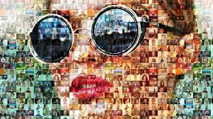
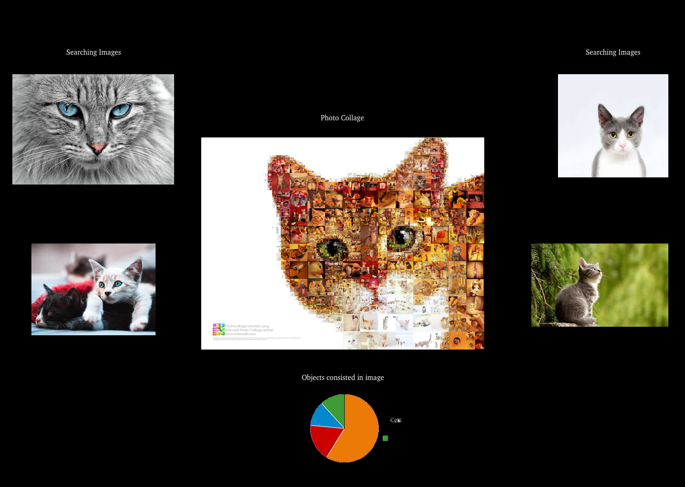
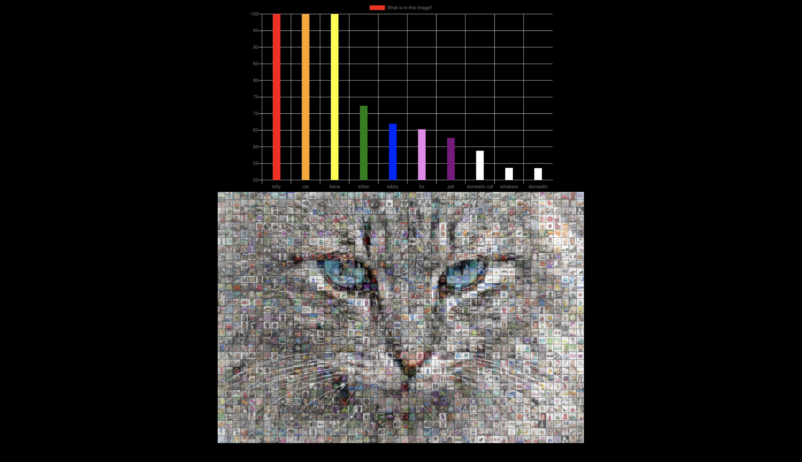

# _CapStone Project_

#### Learning how to use Redux with React and Webpack

Testing

_Published_ **2019-05-03** 
_Author_ **Nathanael Wessels**

1. [Description](#description)
1. [Learning Objective](#learning-objective)
1. [Target Audience/Users](#target-audience/users)
1. [User Stories](#user-stories)
1. [Product Requirements](#product-requirements)
1. [Non-technical Requirements](#non-technical-requirements)
1. [Assumptions](#assumptions)
1. [Development Specs](#development-specs)
1. [Installation](#installation)
1. [Known Bugs](#known-bugs)
1. [Technologies Used](#technologies-used)
1. [License](#license)

### Description

Name of Student: Nate Wessels 
Name of Project: Picture Collage Maker 
Project’s Purpose or Goal: Make a Photo Collage from a picture inputted by user 
List the absolute minimum features the project requires to meet this purpose or goal: 
Takes in any image from user 
Splits the image into sections based off the width and height of the image. It will get the dominant color of each section.
From each dominant color it will get an image from online and replace that section with an image. 
What tools, frameworks, libraries, APIs, modules and/or other resources (whatever is specific to your track, and your language) will you use to create this MVP? List them all here. Be specific. 
Image Recognition API that will return what is consisted in the image. Will be used to get certain images from an image API 
Image API will get thousands of images that have specific dominant colors, and certain objects in image 
Will use React 
Javascript, SCSS 
If you finish developing the minimum viable product (MVP) with time to spare, what will you work on next? Describe these features here: Be specific. 
Will add animations 
Will add firebase to save images to pull up from any device 
Will allow users to upload many of their own images to be used 
What additional tools, frameworks, libraries, APIs, or other resources will these additional features require? 
Firebase 
SCSS 

Is there anything else you’d like your instructor to know?  
Here is an example of what I am wanting this application to do! Im wanting to make a photo out of photos.

### Example Image

### Sketch Planning Images

### Real Example

### Installation
_Below are the steps to follow to install and use this application_
  1. First Go into your terminal on your device and type `/cd desktop`
  2. Second Clone from Github by typing `git clone https://github.com/ngwessels/Capstone-Collage-Maker`
  3. After its done installing make sure you have NPM installed. If not go to this webpage `https://www.npmjs.com/get-npm`
  4. Now type `cd Capstone-Collage-Maker`
  5. Next type in `npm i`. This will take some time.
  6. While waiting we need to get two api-keys: First go to `https://azure.microsoft.com/en-us/services/cognitive-services/bing-image-search-api/` press the `Try for Free` tab. And get your api-key.
  7. Next api-key needed go to `https://imagga.com` and get your Image Recognition Authorization code there.
  8. Now type `touch .env` into the your terminal
  9. Go into your .env in your editor and paste the following in
  `
     imageAPI = "Your Bing Image Api here"
     immaga = "Your immaga Authorization Here"
  `
  10. Now type in `npm run start`. Program should auto launch on google chrome or another web browser

### Known Bugs
* A few bugs known at this time. Most have to do with image aspect ratios, but temporary fix in currenlty

### Technologies Used
* Bash scripts
* React
* Webpack
* iMac
* Atom
* Bing Image APIs
* imagga Image Recognition Api

### License
Copyright (c) 2019 Nate Wessels, Epicodus

Permission is hereby granted, free of charge, to any person obtaining a copy of this software and associated documentation files (the Software), to deal in the Software without restriction, including without limitation the rights to use, copy, modify, merge, publish, distribute, sublicense, and/or sell copies of the Software, and to permit persons to whom the Software is furnished to do so, subject to the following conditions:

The above copyright notice and this permission notice shall be included in all copies or substantial portions of the Software.

THE SOFTWARE IS PROVIDED AS IS, WITHOUT WARRANTY OF ANY KIND, EXPRESS OR IMPLIED, INCLUDING BUT NOT LIMITED TO THE WARRANTIES OF MERCHANTABILITY, FITNESS FOR A PARTICULAR PURPOSE AND NONINFRINGEMENT. IN NO EVENT SHALL THE AUTHORS OR COPYRIGHT HOLDERS BE LIABLE FOR ANY CLAIM, DAMAGES OR OTHER LIABILITY, WHETHER IN AN ACTION OF CONTRACT, TORT OR OTHERWISE, ARISING FROM, OUT OF OR IN CONNECTION WITH THE SOFTWARE OR THE USE OR OTHER DEALINGS IN THE SOFTWARE.
